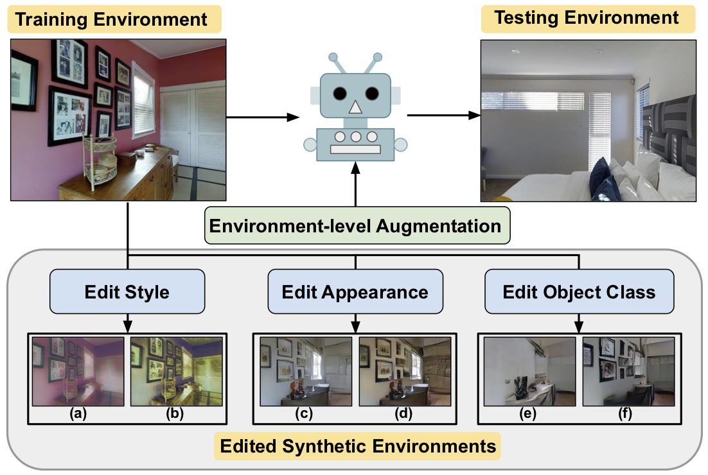

# EnvEdit: Environment Editing for Vision-and-Language Navigation (CVPR 2022)

* Authors: [Jialu Li](https://jialuli-luka.github.io/), [Hao Tan](https://www.cs.unc.edu/~airsplay/), and [Mohit Bansal](https://www.cs.unc.edu/~mbansal/) (UNC Chapel Hill)

* [Paper](https://arxiv.org/abs/2203.15685)

In Vision-and-Language Navigation (VLN), an agent needs to navigate through the environment based on natural language instructions. 
Due to limited available data for agent training and finite diversity in navigation environments, it is challenging for the agent to generalize to new, unseen environments. 
To address this problem, we propose EnvEdit, a data augmentation method that creates new environments by editing existing environments, which are used to train a more generalizable agent. 
Our augmented environments can differ from the seen environments in three diverse aspects: style, object appearance, and object classes. 
Training on these edit-augmented environments prevents the agent from overfitting to existing environments and helps generalize better to new, unseen environments. 
Empirically, on both the Room-to-Room and the multi-lingual Room-Across-Room datasets, we show that our proposed EnvEdit method gets significant improvements in all metrics on both pre-trained and non-pre-trained VLN agents, and achieves the new state-of-the-art on the test leaderboard. 
We further ensemble the VLN agents augmented on different edited environments and show that these edit methods are complementary.



## Environment Installation
1. Follow instructions [here](https://github.com/clip-vil/CLIP-ViL/tree/master/CLIP-ViL-VLN) to install Matterport3D simulators.

2. Install requirements:

```bash
pip install -r python_requirements.txt
```

## Data Preparation
1. Pre-Computed Features:

For using [EnvDrop](https://github.com/clip-vil/CLIP-ViL/tree/master/CLIP-ViL-VLN) as the base agent, pre-extracted visual features can be downloaded:

```bash
wget https://nlp.cs.unc.edu/data/envedit/features.zip
```

The name of the pre-computed features for the original environment: CLIP-ViT-B-`patch_size`-views.tsv

The name of pre-computed features for the edited environments: CLIP-ViT-B-`patch_size`-views-`edit_env_name`.tsv

* `patch_size`: 
    * `16`: ViT-B-16. 
    
    * `32`: ViT-B-32.

* `edit_env_name`: 

    * `st-samefilter`: style transfer with fixed style embedding for 36 discretized views in a panorama.  

    * `st-sameenv`: style transfer with fixed style embedding for one environment.
    
    * `st`: style transfer with random style embedding for every single view.
    
    * `spade-original`: use the same style as the original environment during image synthesis.
    
    * `spade-random`: use random style during image synthesis.
    
    * `spade-mask-original`: use the same style as the original environment, and randomly mask out one class in the semantic segmentation during image synthesis.
    
    * `spade-mask-random`: use random style, and randomly mask out one class in the semantic segmentation during image synthesis.

For using [HAMT](https://github.com/cshizhe/VLN-HAMT) as the base agent, pre-extracted visual features can be downloaded:

```bash
wget https://nlp.cs.unc.edu/data/envedit/features_HAMT.zip
```

The main differences between features for HAMT agent and features for EnvDrop agent lie in 

(1) On Room-to-Room dataset, the features for HAMT are extracted with the visual backbone in pre-trained model (not fine-tuned on VLN task) released in HAMT. The visual backbone does not contain the last representation layer in CLIP. The features for EnvDrop agent are extracted with CLIP pretrained visual backbone with the last representation layer (mapped to 512 dimension). 

(2) On Room-Across-Room dataset, the features for HAMT is exactly the same as the CLIP-ViT-B-32-`edit_env_name`.tsv features we used for EnvDrop agent.


2. Access to Edited Environments:

If you want to access to edited environments, please first sign the Terms of Use agreement form download in [here](https://niessner.github.io/Matterport/) and cc'ed the email to us <jialuli@cs.unc.edu>. And we would share a download link.

3. Download Room-to-Room (R2R) and Room-Across-Room (RxR) datasets.

If you want to work on base agent [EnvDrop](https://github.com/clip-vil/CLIP-ViL/tree/master/CLIP-ViL-VLN), download data following instructions [here](https://github.com/clip-vil/CLIP-ViL/tree/master/CLIP-ViL-VLN)

If you want to work on base agent [HAMT](https://github.com/cshizhe/VLN-HAMT), download data following instructions [here](https://github.com/cshizhe/VLN-HAMT)

## Stage 1: Edited Environment Creation

1. Create Environments with Style Transfer:

First, download the code from [Style Augmentation](https://github.com/philipjackson/style-augmentation) under the ./style_transfer directory for style transfer. Please setup environments according to their instructions.

Next, use style transfer to create edited environments by running:

```bash
cd style_transfer
CUDA_VISIBLE_DEVICES=0 python style_transfer.py --input views_img --output views_img_style_transfer
```

Modify the input path and output path as needed.

2. Create Environments with Image Synthesis:

```bash
cd image_synthesis
```

Matterport3D dataset provides semantic segmentation for the images in the dataset. First, we match the semantic segmentation RGB value to sementic segmentation classes:

```bash
python transfer_semantics.py --input views_sem_image --output views_sem_image_transferred
```

Modify the input path and output path as needed.

Then, create a file list that contains all images in the seen environments. We provide files_img.list and files_sem.list for conveniency. You need to move them to original image directory and transferred semantic segmentation directory respectively and change name to files.list:

```bash
mv files_img.list ../../views_img/files.list
mv files_sem.list ../views_sem_image_transferred/files.list
```

Note that views_img is located outside the directory of EnvEdit, and views_sem_image_transferred is located under the directory of EnvEdit (outside image_synthesis directory).
You need to manually change the content in files_img.list and files_sem.list if your views_img and views_sem_image_transferred are located elsewhere.

Then, we use the [SPADE](https://github.com/NVlabs/SPADE) code（with small modifications) for creating edited environments with image synthesis. Please setup environments according to their instructions.

To train SPADE to VLN dataset:

```bash
bash scripts/train.bash
```

* `label_dir`: path to semantic segmentation classes

* `image_dir`: path to original environment views

* `label_nc`: `42` if training without randomly masking out object classes. `43` if training with masking out object classes.

* `mask_num`: `0` if training without randomly masking out object classes. `1` if training with masking out object classes. Could potentially use any number smaller than 42 (but we didn't experiment with masking out more object classes during training).

* `gpu_id`: set gpu ID

To generate edited environments with trained model:

```bash
bash scripts/test.bash
```

* `style_method`: 

    * `original`: using the same style as the original enviornments. 
    
    * `random`: using random style for synthesizing the environments.

* `output_dir`: path to output edited environments.


## Stage 2: VLN Navigation Agent Training

Train the agent on both the original environment and the edited enviornment:

```bash
bash run/agent.bash 0
```

* `feature_extract`: path to 16/32 features for the original environment.

* `aug_env`: path to 16/32 features for the edited environment.

* `dataset`: `R2R` or `RxR` depending on the training dataset.

## Stage 3: Back Translation with Style-aware Speaker 

Train the style-aware speaker with:

```bash
bash run/speaker.bash 0
```

* `feature_extract`: path to 16/32 features for the original environment.

* `aug_env`: path to 16/32 features for the edited environment. 

* `style_embedding`: path to style embedding extracted with style encoder learned in Stage 1 with image synthesis (SPADE) model. (We'll provide a download link for the style embedding pre-extracted by us ASAP.)


Back Translation with style-aware speaker:

```bash
bash run/bt.bash 0
```

* `speaker`: path to trained style-aware speaker.

* `load`: path to trained VLN agent in Stage 2.

* `style_embedding`: path to style embedding of the original environment extracted with style encoder learned in Stage 1.

* `style_embedding_aug`: path to style embedding of the edited environment extracted with style encoder learned in Stage 1.

## Citation

If you find this work useful, please consider citing:

```bibtex
@inproceedings{li2022envedit,
  title     = {EnvEdit: Environment Editing for Vision-and-Language Navigation},
  author    = {Jialu Li, Hao Tan, Mohit Bansal},
  booktitle = {CVPR},
  year      = {2022}
}
```

## Acknowledgement:

We thank the developers of [EnvDrop](https://github.com/clip-vil/CLIP-ViL/tree/master/CLIP-ViL-VLN), [HAMT](https://github.com/cshizhe/VLN-HAMT), [Style Augmentation](https://github.com/philipjackson/style-augmentation), [SPADE](https://github.com/NVlabs/SPADE) for their public code release.

